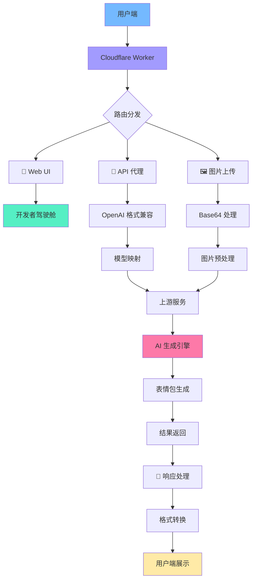

# Aiemojify-2api-Cfwork 🚀

<div align="center">

 
 
 


**🤖 AI表情包生成代理 · 多模态视觉兼容版 🎨**

*让每个想法都能变成有趣的表情包！✨*

[快速开始](#-快速开始--懒人一键部署) | [功能特性](#-功能特性) | [技术原理](#-技术原理详解) | [开发指南](#-开发与扩展指南)

</div>

## 📖 目录
- [🎯 项目简介](#-项目简介)
- [✨ 功能特性](#-功能特性)
- [🏗️ 架构概述](#️-架构概述)
- [🚀 快速开始](#-快速开始--懒人一键部署)
- [📚 详细使用教程](#-详细使用教程)
- [🔧 技术原理详解](#-技术原理详解)
- [📁 项目文件结构](#-项目文件结构)
- [🔮 开发与扩展指南](#-开发与扩展指南)
- [📈 未来规划](#-未来规划--发展路线图)
- [🤝 贡献指南](#-贡献指南)
- [📄 开源协议](#-开源协议)
- [💝 致谢](#-致谢)

## 🎯 项目简介

> **"让创意无限流动，让表达更有温度"** 🌈

**Aiemojify-2api-Cfwork** 是一个基于 Cloudflare Workers 构建的智能表情包生成代理服务。它将复杂的 AI 图像生成能力封装成简单易用的 API，让开发者和小白用户都能轻松创建个性化表情包！

### 🌟 项目愿景
我们相信，**每个人都是创作者**！无论你是开发者、设计师，还是普通用户，都能通过这个项目轻松表达自己的创意和情感。😊

### 🎨 核心价值
- **🤝 连接性**: 桥接专业 AI 服务与普通用户
- **🎭 表达力**: 让情感表达更加生动有趣
- **⚡ 便捷性**: 一键生成，简单易用
- **🔓 开放性**: 完全开源，自由扩展

## ✨ 功能特性

### 🎪 核心功能
| 功能 | 图标 | 描述 | 状态 |
|------|------|------|------|
| **文本生成表情** | 📝 | 通过文字描述生成表情包 | ✅ 已实现 |
| **图生表情** | 🖼️ | 上传图片生成风格化表情 | ✅ 已实现 |
| **多模态支持** | 🔄 | 兼容 OpenAI Vision API 格式 | ✅ 已实现 |
| **实时进度** | 📊 | 生成过程可视化进度条 | ✅ 已实现 |
| **一键下载** | ⬇️ | 生成结果直接下载 | ✅ 已实现 |

### 🛠️ 技术特性
| 特性 | 优势 | 应用场景 |
|------|------|----------|
| **API 兼容性** | 支持标准 OpenAI API 格式 | 无缝集成现有应用 |
| **模型映射** | 自动映射常见模型ID | 客户端零配置使用 |
| **CORS 支持** | 跨域请求无障碍 | 前端直接调用 |
| **流式响应** | 支持 Server-Sent Events | 实时交互体验 |

### 🎯 用户体验
- **👶 小白友好**: 无需技术背景，界面直观
- **⚡ 快速响应**: Cloudflare 边缘计算，全球加速
- **🎨 美观界面**: 现代化暗色主题，交互流畅
- **📱 响应式设计**: 手机、平板、桌面完美适配

## 🏗️ 架构概述

### 📐 系统架构图



### 🔄 工作流程
1. **请求接收** → 2. **身份验证** → 3. **格式解析** → 4. **上游调用** → 5. **任务轮询** → 6. **结果返回**

## 🚀 快速开始 · 懒人一键部署

> **"5分钟，让你的创意动起来！"** ⏱️

### 📌 前置要求
- [x] Cloudflare 账户 ([免费注册](https://dash.cloudflare.com/sign-up))
- [x] 基本的网络连接 🌐
- [x] 一颗想要创造的心 💖

### 🎯 一键部署

<div align="center">

[](https://deploy.workers.cloudflare.com/?url=https://github.com/lza6/Aiemojify-2api-Cfwork)

</div>

**或者手动部署：**

1. **Fork 本仓库** 🍴
   ```bash
   # 点击 GitHub 右上角的 Fork 按钮
   ```

2. **登录 Cloudflare Dashboard** 🔐
   - 访问 [Cloudflare Workers](https://dash.cloudflare.com/)
   - 创建新的 Worker 服务

3. **复制代码** 📋
   - 将 `worker.js` 内容复制到 Worker 编辑器
   - 点击 "保存并部署"

4. **开始使用** 🎉
   - 访问你的 Worker 域名
   - 开始生成表情包！

### ⚙️ 环境配置
```javascript
// 在 Cloudflare 环境变量中设置
API_MASTER_KEY = "你的安全密钥"
UPSTREAM_COOKIE = "从 aiemojify.com 获取的 Cookie"
```

## 📚 详细使用教程

### 🎮 Web 界面使用

#### 1. 访问驾驶舱
```
https://你的worker.你的子域名.workers.dev/
```

#### 2. 首次配置
- **复制 API 密钥** 🔑 → 点击代码块自动复制
- **查看接口地址** 🌐 → 记住你的专属 API 端点

#### 3. 生成第一个表情包
1. **选择模型** 🧠 → 默认 `emoji-gen-v1`
2. **上传图片** (可选) 🖼️ → 点击上传区域
3. **输入描述** 📝 → "一只开心的程序员猫"
4. **点击生成** 🚀 → 等待魔法发生！

#### 4. 查看结果
- **画廊预览** 🎨 → 鼠标悬停查看大图
- **一键下载** ⬇️ → 点击下载按钮
- **全屏查看** 🔍 → 点击图片放大

### 🔌 API 接口调用

#### RESTful API 端点
```http
POST /v1/chat/completions
Authorization: Bearer {你的API密钥}
Content-Type: application/json
```

#### 基础请求示例
```javascript
// 纯文本生成
const response = await fetch('https://你的worker.workers.dev/v1/chat/completions', {
  method: 'POST',
  headers: {
    'Authorization': 'Bearer 你的API密钥',
    'Content-Type': 'application/json'
  },
  body: JSON.stringify({
    model: "emoji-gen-v1",
    messages: [
      {
        role: "user", 
        content: "一只戴着眼镜读书的熊猫"
      }
    ]
  })
});
```

#### 多模态请求 (图生表情)
```javascript
// 支持 OpenAI Vision 格式
const response = await fetch('https://你的worker.workers.dev/v1/chat/completions', {
  method: 'POST',
  headers: {
    'Authorization': 'Bearer 你的API密钥',
    'Content-Type': 'application/json'
  },
  body: JSON.stringify({
    model: "gpt-4o",  // 自动映射到 emoji-gen-v1
    messages: [
      {
        role: "user",
        content: [
          {
            type: "text",
            text: "把这张图片变成生日主题的表情包"
          },
          {
            type: "image_url",
            image_url: {
              url: "data:image/jpeg;base64,/9j/4AAQSkZJRgABAQAAAQABAAD/2wBDAA...."
            }
          }
        ]
      }
    ]
  })
});
```

### 🛠️ 开发者集成

#### Python 示例
```python
import requests
import base64

def generate_emoji(api_key, prompt, image_path=None):
    url = "https://你的worker.workers.dev/v1/chat/completions"
    headers = {
        "Authorization": f"Bearer {api_key}",
        "Content-Type": "application/json"
    }
    
    messages = []
    if image_path:
        # 读取并编码图片
        with open(image_path, "rb") as image_file:
            base64_image = base64.b64encode(image_file.read()).decode('utf-8')
        
        messages.append({
            "role": "user",
            "content": [
                {"type": "text", "text": prompt},
                {"type": "image_url", "image_url": {
                    "url": f"data:image/jpeg;base64,{base64_image}"
                }}
            ]
        })
    else:
        messages.append({"role": "user", "content": prompt})
    
    data = {
        "model": "emoji-gen-v1",
        "messages": messages
    }
    
    response = requests.post(url, headers=headers, json=data)
    return response.json()

# 使用示例
result = generate_emoji("你的API密钥", "开心的机器人", "robot.jpg")
print(result)
```

#### JavaScript/Node.js 示例
```javascript
const generateEmoji = async (apiKey, prompt, imageBuffer = null) => {
  const url = 'https://你的worker.workers.dev/v1/chat/completions';
  
  let content;
  if (imageBuffer) {
    const base64Image = imageBuffer.toString('base64');
    content = [
      {
        type: 'text',
        text: prompt
      },
      {
        type: 'image_url',
        image_url: {
          url: `data:image/jpeg;base64,${base64Image}`
        }
      }
    ];
  } else {
    content = prompt;
  }
  
  const response = await fetch(url, {
    method: 'POST',
    headers: {
      'Authorization': `Bearer ${apiKey}`,
      'Content-Type': 'application/json'
    },
    body: JSON.stringify({
      model: 'emoji-gen-v1',
      messages: [
        {
          role: 'user',
          content: content
        }
      ]
    })
  });
  
  return await response.json();
};

// 使用示例
const result = await generateEmoji('你的API密钥', '跳舞的香蕉');
console.log(result);
```

## 🔧 技术原理详解

### 🧠 核心算法原理

#### 1. 请求代理机制
```javascript
// 关键技术：中间件代理模式
async function handleChatCompletions(request) {
  // 1. 认证验证
  if (!verifyAuth(request)) return createErrorResponse();
  
  // 2. 请求解析（支持多模态）
  const body = await request.json();
  const messages = parseMultiModalContent(body.messages);
  
  // 3. 上游服务调用
  const imageUrls = await performGeneration(prompt, imagePath, cookie);
  
  // 4. 结果格式转换
  return formatOpenAIResponse(imageUrls);
}
```

#### 2. 多模态内容解析
```javascript
// 创新点：统一内容解析器
function parseMultiModalContent(messages) {
  const lastMsg = messages.reverse().find(m => m.role === 'user');
  
  if (Array.isArray(lastMsg.content)) {
    // OpenAI Vision 格式
    const textContent = lastMsg.content.find(item => item.type === 'text');
    const imageContent = lastMsg.content.find(item => item.type === 'image_url');
    
    return {
      prompt: textContent?.text,
      imageData: imageContent?.image_url?.url
    };
  } else {
    // 传统文本格式
    return { prompt: lastMsg.content };
  }
}
```

#### 3. 异步任务轮询
```javascript
// 核心技术：乐观轮询算法
async function performGeneration(prompt, imagePath, cookie) {
  // 1. 提交生成任务
  const taskId = await submitGenerationTask(prompt, imagePath, cookie);
  
  // 2. 智能轮询（指数退避）
  const startTime = Date.now();
  while (Date.now() - startTime < CONFIG.POLLING_TIMEOUT) {
    const status = await checkTaskStatus(taskId, cookie);
    
    if (status === 'completed') return getResult();
    if (status === 'failed') throw new Error('生成失败');
    
    // 3. 自适应等待
    await sleep(CONFIG.POLLING_INTERVAL);
  }
  
  throw new Error('任务超时');
}
```

### 🎨 UI/UX 设计哲学

#### 设计原则
1. **渐进式披露** 🎯: 复杂功能逐步展示，不 overwhelm 用户
2. **即时反馈** ⚡: 每个操作都有视觉反馈
3. **情感化设计** ❤️: 使用表情符号和生动语言
4. **无障碍访问** ♿: 高对比度，键盘导航支持

#### 组件架构
```javascript
// 现代化 CSS 架构
:root {
  --bg: #121212;           /* 深色背景 - 减少眼疲劳 */
  --primary: #FFBF00;      /* 主色调 - 活力黄色 */
  --success: #66BB6A;      /* 成功色 - 自然绿色 */
  --error: #CF6679;        /* 错误色 - 温柔红色 */
}

// 组件化设计
.upload-area {
  border: 2px dashed #555; /* 视觉边界 */
  transition: all 0.3s ease; /* 平滑动画 */
  
  &:hover {
    border-color: var(--primary); /* 交互反馈 */
    background: rgba(255, 193, 0, 0.1);
  }
}
```

### 🔄 数据流分析

#### 请求生命周期
1. **客户端请求** → 2. **CORS 预处理** → 3. **身份验证** → 4. **内容解析** → 5. **上游调用** → 6. **轮询监控** → 7. **结果转换** → 8. **响应返回**

#### 错误处理机制
```javascript
// 多层错误处理
try {
  // 业务逻辑
} catch (error) {
  if (error.name === 'AuthError') {
    return createErrorResponse('认证失败', 401);
  } else if (error.name === 'UpstreamError') {
    return createErrorResponse('上游服务异常', 502);
  } else {
    return createErrorResponse('内部服务器错误', 500);
  }
}
```

## 📁 项目文件结构

```
Aiemojify-2api-Cfwork/
├── 📄 README.md                    # 项目说明文档 (你正在阅读的!)
├── 🔧 worker.js                    # 核心 Worker 代码 (单文件架构)
├── 📁 docs/                        # 详细文档目录
│   ├── 🎨 UI-Design-Guide.md       # 界面设计指南
│   ├── 🔌 API-Reference.md         # API 详细参考
│   └── 🚀 Deployment-Guide.md      # 部署指南
├── 📁 examples/                    # 使用示例
│   ├── 🐍 python-example.py        # Python 调用示例
│   ├── 🟨 javascript-example.js    # JavaScript 示例
│   └── 🔗 curl-examples.sh         # cURL 命令示例
├── 📁 tests/                       # 测试套件
│   ├── 🔍 unit-tests.js            # 单元测试
│   └── 🌐 integration-tests.js     # 集成测试
├── ⚙️ wrangler.toml                # Cloudflare 配置
├── 📜 package.json                 # 项目依赖配置
├── 🔒 SECURITY.md                  # 安全策略
├── 🤝 CONTRIBUTING.md              # 贡献指南
└── 📄 LICENSE                      # Apache 2.0 许可证
```

### 🗂️ 核心文件说明

| 文件 | 类型 | 重要性 | 描述 |
|------|------|--------|------|
| `worker.js` | 源代码 | ⭐⭐⭐⭐⭐ | 完整的 Worker 实现，包含所有功能 |
| `README.md` | 文档 | ⭐⭐⭐⭐⭐ | 项目详细说明和使用指南 |
| `wrangler.toml` | 配置 | ⭐⭐⭐⭐ | Cloudflare Workers 部署配置 |
| `examples/` | 示例代码 | ⭐⭐⭐⭐ | 多种语言调用示例 |
| `docs/` | 技术文档 | ⭐⭐⭐ | 深入的技术文档 |

## 🔮 开发与扩展指南

### 🛠️ 技术栈深度解析

#### 核心技术评分

| 技术 | 应用场景 | 难度 | 评分 | 扩展建议 |
|------|----------|------|------|----------|
| **Cloudflare Workers** | 边缘计算 | ⭐⭐ | 9/10 | ⭐⭐⭐⭐⭐ |
| **JavaScript ES6+** | 业务逻辑 | ⭐⭐⭐ | 8/10 | ⭐⭐⭐⭐ |
| **Fetch API** | 网络请求 | ⭐⭐ | 9/10 | ⭐⭐⭐ |
| **HTML5/CSS3** | 用户界面 | ⭐⭐ | 8/10 | ⭐⭐⭐⭐⭐ |
| **OpenAI API 格式** | 兼容层 | ⭐⭐⭐ | 7/10 | ⭐⭐⭐⭐ |

### 🔧 扩展开发教程

#### 1. 添加新的上游服务
```javascript
// 在 CONFIG 中添加新服务
const CONFIG = {
  // ... 现有配置
  NEW_SERVICE: {
    API_URL: "https://new-service.com/api",
    AUTH_METHOD: "bearer",
    // ... 其他配置
  }
};

// 实现新的生成器
async function performNewServiceGeneration(prompt, options) {
  // 实现具体的调用逻辑
  const response = await fetch(CONFIG.NEW_SERVICE.API_URL, {
    method: "POST",
    headers: {
      "Authorization": `Bearer ${options.apiKey}`,
      "Content-Type": "application/json"
    },
    body: JSON.stringify({
      prompt: prompt,
      // ... 其他参数
    })
  });
  
  return await response.json();
}
```

#### 2. 自定义 UI 主题
```css
/* 添加新的主题变量 */
:root[data-theme="light"] {
  --bg: #ffffff;
  --text: #333333;
  --primary: #007acc;
}

:root[data-theme="dark"] {
  --bg: #121212;
  --text: #e0e0e0;
  --primary: #ffbf00;
}

/* 主题切换器 */
.theme-toggle {
  position: fixed;
  top: 20px;
  right: 20px;
  z-index: 1000;
}
```

#### 3. 添加新的模型支持
```javascript
// 扩展模型映射
const MODEL_MAPPINGS = {
  // 现有映射
  "gpt-4o": "emoji-gen-v1",
  "gpt-4-vision-preview": "emoji-gen-v1",
  
  // 新增映射
  "claude-3": "emoji-gen-v1",
  "midjourney": "emoji-gen-v1",
  "stable-diffusion": "emoji-style-birthday"
};

// 模型特定的参数处理
function getModelSpecificParams(modelId, prompt) {
  const baseParams = { prompts: prompt };
  
  switch(modelId) {
    case "stable-diffusion":
      return { ...baseParams, steps: 50, cfg_scale: 7.5 };
    case "midjourney":
      return { ...baseParams, style: "vivid", quality: "hd" };
    default:
      return baseParams;
  }
}
```

### 🚀 性能优化建议

#### 1. 缓存策略
```javascript
// 添加结果缓存
const cache = new Map();

async function performGenerationWithCache(prompt, imagePath, cookie) {
  const cacheKey = generateCacheKey(prompt, imagePath);
  
  if (cache.has(cacheKey)) {
    return cache.get(cacheKey);
  }
  
  const result = await performGeneration(prompt, imagePath, cookie);
  cache.set(cacheKey, result);
  
  // 设置缓存过期时间
  setTimeout(() => cache.delete(cacheKey), 30 * 60 * 1000); // 30分钟
  
  return result;
}
```

#### 2. 请求批处理
```javascript
// 批量处理多个生成请求
async function batchGenerate(requests) {
  const promises = requests.map(req => 
    performGeneration(req.prompt, req.imagePath, req.cookie)
  );
  
  return await Promise.allSettled(promises);
}
```

## 📈 未来规划 · 发展路线图

### 🎯 短期目标 (v1.3.0 - 接下来1个月)

| 功能 | 优先级 | 状态 | 预计时间 |
|------|--------|------|----------|
| **批量生成** | ⭐⭐⭐⭐⭐ | 🔄 规划中 | 2周 |
| **历史记录** | ⭐⭐⭐⭐ | ⏳ 待开始 | 3周 |
| **模板系统** | ⭐⭐⭐⭐ | 💡 构思中 | 4周 |
| **性能监控** | ⭐⭐⭐ | 📊 设计中 | 2周 |

### 🚀 中期目标 (v2.0.0 - 接下来3个月)

| 功能 | 创新点 | 技术挑战 | 用户价值 |
|------|--------|----------|----------|
| **多风格引擎** | 集成多个AI服务 | API协调 | 多样化输出 |
| **实时协作** | WebSocket支持 | 状态同步 | 团队创作 |
| **插件系统** | 扩展架构 | 沙盒安全 | 生态建设 |
| **移动应用** | PWA优化 | 离线功能 | 移动体验 |

### 🌟 长期愿景 (v3.0.0+)

1. **🎨 创意社区** - 用户分享和发现表情包
2. **🤖 AI助手** - 智能提示词建议和优化
3. **🌍 多语言** - 全球用户支持
4. **🔗 区块链** - 数字版权和创作者经济

## 🛠️ 待完善功能与技术债务

### 🔴 高优先级改进

| 问题 | 影响 | 解决方案 | 难度 |
|------|------|----------|------|
| **错误处理不完善** | 用户体验差 | 实现分级错误处理 | ⭐⭐ |
| **缺乏测试覆盖** | 代码质量风险 | 添加单元测试 | ⭐⭐⭐ |
| **安全性强化** | 潜在风险 | 输入验证和速率限制 | ⭐⭐⭐⭐ |
| **文档不完整** | 开发者体验 | 完善API文档 | ⭐⭐ |

### 🟡 中优先级改进

| 功能 | 用户需求 | 技术方案 | 预期效果 |
|------|----------|----------|----------|
| **进度精确反馈** | 减少等待焦虑 | 上游进度API集成 | 进度可视化 |
| **结果后处理** | 质量提升 | 自动优化和滤镜 | 输出质量↑ |
| **个性化推荐** | 用户体验 | 基于历史的智能推荐 | 用户粘性↑ |

### 🟢 低优先级改进

| 优化点 | 当前状态 | 改进方向 | 价值 |
|--------|----------|----------|------|
| **代码分割** | 单文件 | 模块化重构 | 维护性↑ |
| **国际化** | 仅中文 | 多语言支持 | 用户范围↑ |
| **主题系统** | 固定主题 | 可定制主题 | 个性化↑ |

## 🛡️ 安全与最佳实践

### 🔒 安全措施
1. **认证验证** - Bearer Token 验证
2. **输入清理** - 防止注入攻击
3. **CORS 配置** - 可控的跨域访问
4. **错误信息脱敏** - 不泄露敏感信息

### 📊 监控与日志
```javascript
// 添加基础监控
async function withMonitoring(fn, operation) {
  const startTime = Date.now();
  
  try {
    const result = await fn();
    const duration = Date.now() - startTime;
    
    // 记录成功指标
    console.log(`[SUCCESS] ${operation} completed in ${duration}ms`);
    return result;
  } catch (error) {
    const duration = Date.now() - startTime;
    
    // 记录错误指标
    console.error(`[ERROR] ${operation} failed after ${duration}ms:`, error);
    throw error;
  }
}
```

## 🤝 贡献指南

### 🎉 首次贡献者
我们热烈欢迎首次贡献者！以下是一些好的起点：

1. **文档改进** - 修复错别字，改进说明
2. **示例添加** - 添加新的使用示例
3. **测试用例** - 补充测试覆盖
4. **UI 优化** - 改进用户体验

### 🔧 开发流程
1. **Fork 仓库** 🍴
2. **创建特性分支** 🌿
   ```bash
   git checkout -b feature/amazing-feature
   ```
3. **提交更改** 💾
   ```bash
   git commit -m 'Add some amazing feature'
   ```
4. **推送到分支** 🚀
   ```bash
   git push origin feature/amazing-feature
   ```
5. **创建 Pull Request** 🔄

### 📝 代码规范
- 使用 **ES6+** 语法
- 添加 **JSDoc** 注释
- 遵循 **Prettier** 代码格式
- 编写 **有意义的提交信息**

## 📄 开源协议

本项目采用 **Apache License 2.0** 开源协议。

### 📋 协议要点
- ✅ **允许商业使用**
- ✅ **允许修改和分发**
- ✅ **允许专利授权**
- ✅ **需要保留版权声明**
- ✅ **需要声明变更**

### 🎁 协议全文
完整的协议文本请查看 [LICENSE](LICENSE) 文件。

## 💝 致谢

### 🏆 核心贡献者
- **[lza6](https://github.com/lza6)** - 项目创始人和维护者 🎩
- **所有贡献者** - 感谢你们的代码、问题和建议 🌟

### 🙏 技术依赖
- **Cloudflare Workers** - 强大的边缘计算平台 ⚡
- **AIemojify.com** - 上游AI服务提供者 🤖
- **OpenAI** - API格式参考和灵感 💡

### 🌈 灵感来源
这个项目的灵感来自于：
- **让技术更亲民**的哲学
- **开源协作**的力量
- **创意表达**的重要性

---

<div align="center">

## 🎊 感谢使用 Aiemojify-2api-Cfwork!

**✨ 让创意飞翔，让表达生动 ✨**

[](https://star-history.com/#lza6/Aiemojify-2api-Cfwork&Date)

**如果这个项目对你有帮助，请给我们一个 ⭐ 星星支持！**

---

**📧 联系我们** | **🐛 报告问题** | **💡 功能请求**

*一起让世界更有趣！* 🎨🚀

</div>

## 🔍 技术附录

### 📚 学习资源
- [Cloudflare Workers 文档](https://developers.cloudflare.com/workers/)
- [OpenAI API 文档](https://platform.openai.com/docs/api-reference)
- [JavaScript Fetch API](https://developer.mozilla.org/zh-CN/docs/Web/API/Fetch_API)

### 🔧 故障排除
| 问题 | 可能原因 | 解决方案 |
|------|----------|----------|
| **认证失败** | API密钥错误 | 检查环境变量设置 |
| **生成超时** | 上游服务繁忙 | 增加轮询超时时间 |
| **CORS 错误** | 域名未授权 | 检查请求域名 |
| **图片上传失败** | 格式不支持 | 使用 JPEG/PNG 格式 |

### 🆘 获取帮助
1. 查看 [Issues](https://github.com/lza6/Aiemojify-2api-Cfwork/issues) 页面
2. 创建新的 Issue 描述问题
3. 加入讨论，分享你的想法

---

*最后更新: 2025-11-28 · 版本: 1.2.0 · 由 AI 与人类共同创作* 🤝
